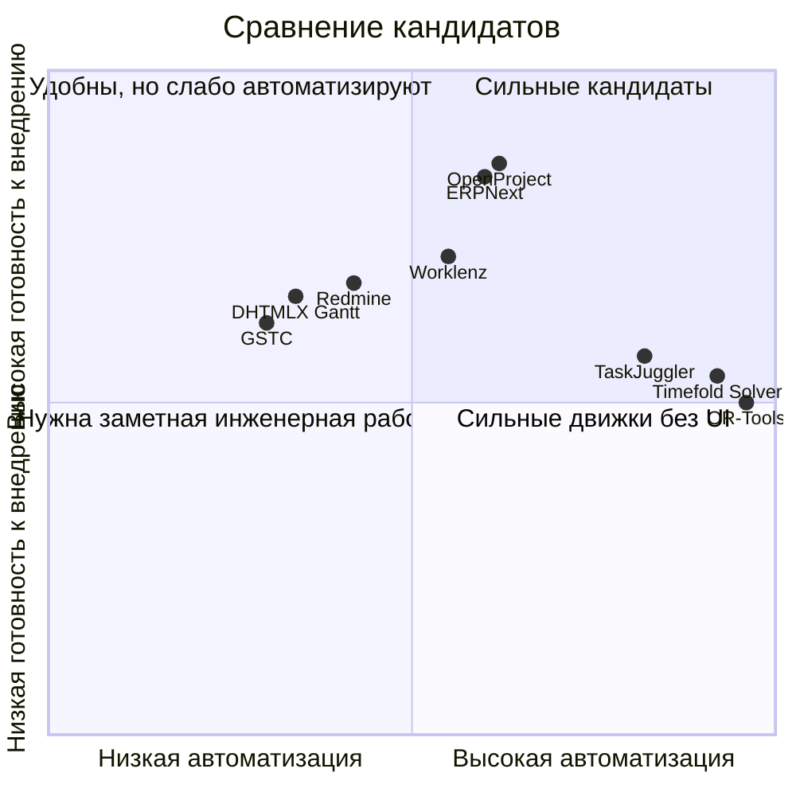

# GitHub-репозитории для Gantt и автоматического ресурсного планирования проектов

## Исполнительное резюме

По состоянию на 4 мая 2026 года среди готовых GitHub-репозиториев нет одного идеального OSS-решения, которое одновременно давало бы зрелый командный интерфейс уровня PM-системы, полноценный Gantt, и действительно сильный автоматический движок распределения людей по нескольким проектам под ограничения навыков, календарей, загрузки и приоритетов. На практике рынок делится на три класса: готовые PM-системы с Gantt и учётом загрузки, но без сильной оптимизации; оптимизационные движки без пользовательского интерфейса; и UI-компоненты для сборки собственного планировщика. Это хорошо видно по связке возможностей в `OpenProject`, `ERPNext`, `Worklenz`, `TaskJuggler`, `Timefold Solver` и `OR-Tools`. citeturn11view0turn34search2turn34search16turn12view1turn17search18turn11view3turn22view2turn26view1turn26view2

Если нужен **быстрый пилот с минимальным сопротивлением команды**, лучшая база — `OpenProject` или `ERPNext`: оба проекта зрелые, активно обновляются, имеют хорошую документацию, самохостинг и подходят как “system of record” для задач, сроков, зависимостей и факта времени. `Worklenz` — сильная современная альтернатива, если хочется более лёгкий и менее ERP-нагруженный стек. citeturn11view0turn5view0turn12view1turn15view0turn11view3turn15view1

Если же цель именно **автоматизировать распределение ресурсов по проектам**, то лучший практический путь — не искать “волшебный монолит”, а строить двухслойную схему: PM-платформа для командной работы + отдельный оптимизатор. Для этого особенно сильны `Timefold Solver` (если у вас Java/Kotlin/Spring/Quarkus) и `OR-Tools` (если нужен максимально гибкий solver в Python/C++/Java/C#). `TaskJuggler` занимает промежуточную нишу: это уже проектный планировщик с оптимизирующим scheduler’ом и балансировщиком ресурсов, но с text-first/CLI-подходом, что уменьшает удобство повседневной командной работы. citeturn22view2turn26view1turn26view2turn31view1turn37search6

Есть и важные **лицензионные/продуктовые оговорки**. В `DHTMLX/gantt` продвинутые функции вроде resource management и auto scheduling относятся к PRO-редакции, а публичный GitHub-репозиторий — це GPL-версия для GPL-проектов; для не-GPL использования нужна коммерческая лицензия. `GSTC` вообще не под классической OSS-лицензией, а под free/trial/commercial terms. `ProjectLibre` на GitHub выглядит практически замороженным; для нового внедрения я бы не рекомендовал делать на него ставку без отдельной юридической и технической проверки. citeturn21view0turn26view0turn24view0turn19view1

## Методика и критерии отбора

В выборку включены 13 репозиториев, которые попадают хотя бы в одну из трёх полезных для вас категорий: готовые PM-системы с Gantt и ресурсной перспективой, оптимизационные движки для автоматического планирования, либо UI-компоненты, на которых реально собрать свой планировщик. Приоритет отдан GitHub-репозиториям, официальной документации, релизам, README и страницам commit history.  
Если параметр в источниках явно не указан, я пометил его как **«не указано»**. Активность в таблице — это комбинация видимых на GitHub звёзд/форков, даты релиза и даты верхних коммитов.

## Сравнительная таблица

| Репозиторий | Тип | Gantt / timeline | Авто-распределение и оптимизация | Интеграции / API | Язык / стек | Лицензия | Активность | Готовность для вашей цели | Источники |
|---|---|---|---|---|---|---|---|---|---|
| OpenProject | Web PM-система | Полный Gantt, drag-and-drop, зависимости, auto/manual scheduling | Частично: зависимостное автопланирование, но не solver-grade мультипроектная оптимизация | API v3, GitHub PR integration | Ruby/Rails | GPL-3.0 | ~15k★, 3.2k forks; релиз 2026-04-20; коммиты 2026-05-02 | **Готов** как ядро процесса | repo/docs citeturn11view0turn5view0turn34search2turn34search16turn34search1turn34search7 |
| Redmine | Web tracker/PM | Gantt и calendar по issue dates | Базово: auto Gantt от дат; серьёзное ресурсное планирование — через plugins/custom | REST API, SCM integration | Ruby on Rails | GPL v2 | ~5.9k★, 2.4k forks; верхние коммиты 2026-04-19 | **Требует доработки** | repo/docs citeturn11view1turn14view0turn16search0turn16search16turn16search2turn38search0 |
| ERPNext | ERP + Projects | Gantt/Kanban/Calendar для tasks | Частично: проекты, таймшиты, фактическая загрузка; capacity planning явно описан для manufacturing | Документация, демо, bench/docker, тесная интеграция с ERP-модулями | Python + JavaScript | GPL-3.0 | ~33.5k★, 11.1k forks; релиз 2026-04-28; коммиты 2026-05-04 | **Готов** | repo/docs citeturn12view1turn15view0turn17search18turn17search3turn17search8turn17search4 |
| Worklenz | Современная web PM-система | List/board/Gantt | Есть resource planning, workload/analytics; solver-оптимизация не заявлена | Cloud/self-host; в стеке заявлены REST API и PostgreSQL/Express | TypeScript, React/JS, PostgreSQL | AGPL-3.0 | ~3k★, 312 forks; релиз 2026-02-09; коммиты 2026-02-25 | **Требует доработки** | repo/docs citeturn11view3turn15view1turn35view0turn9search10 |
| GanttProject | Desktop PM | Gantt, PERT, resource load chart | Есть ресурсная загрузка и costing, но не современный автоматический solver | WebDAV, экспорт/импорт MS Project, Excel, PDF/HTML/PNG | Java + Kotlin | GPL-3.0 | ~1.1k★, 328 forks; релиз 2024-01-22; коммиты 2026-04-06 | **Требует доработки** | repo/docs citeturn19view0turn23view0turn36search7turn36search3turn36search2 |
| ProjectLibre | Desktop PM | Gantt, PERT, RBS | Авто-оптимизация ресурсов по источникам не подтверждается | Источник на GitHub есть, но экосистема и docs на GitHub ограничены | Java | **Не указано** в просмотренных GitHub-страницах | 72★, 36 forks; верхние коммиты 2015-11-23 | **Исследование** | repo/history citeturn19view1turn24view0turn18search1 |
| TaskJuggler | Plan-as-code PM | Генерирует project timelines; позиционируется “beyond Gantt” | Да: optimizing scheduler, resource balancer, consistency checker | Текстовые project files, tutorial/examples | Ruby | GPL-2.0 | 802★, 184 forks; верхние коммиты 2025-07-28 | **Требует доработки** | repo/docs citeturn22view2turn24view1turn19view2turn9search11 |
| DHTMLX/gantt | JS Gantt library | Очень сильный web Gantt | В OSS-репо auto scheduling/resource management только в PRO | Интеграции с Vue, Angular, React, Node, Python, Rails, PHP; live demo и samples | JavaScript | GPL-2.0 для Standard; non-GPL — коммерчески | ~1.8k★, 354 forks; релиз/коммит 2026-04-28 | **Требует доработки** | repo/docs citeturn21view0turn24view2turn35view2 |
| GSTC | Custom scheduling UI component | Gantt + schedule + timeline + calendar | Поддерживает сложные UI rules и огромные datasets, но solver внутри не заявлен | React/Next/Vue/Angular/Svelte examples, online examples | TypeScript | Free / Trial / Commercial terms | ~3.6k★, 384 forks; коммиты 2026-04-24 | **Требует доработки** | repo/docs citeturn26view0turn27view0turn33view2turn25search0turn25search4 |
| OR-Tools | Optimization engine | Нет UI | Да: CP/CP-SAT, MIP, routing; подходит для RCPSP/job-shop/resource allocation | Python, Java, C# wrappers поверх C++ core | C++ core + Python/C#/Java | Apache-2.0 | ~13.4k★, 2.4k forks; релиз 2026-01-12; stable commits 2026-03-31 | **Требует доработки** | repo/docs citeturn26view1turn27view1turn32view0turn7search3turn7search11 |
| Timefold Solver | Optimization engine | Нет UI | Да: task assignment, employee rostering, maintenance/job-shop scheduling | Java/Kotlin; quickstarts; Spring Boot и Quarkus integration | Java + Kotlin | Apache-2.0 | ~1.6k★, 193 forks; релиз 2026-04-22; коммиты 2026-05-04 | **Требует доработки** | repo/docs citeturn26view2turn35view3turn33view0turn37search0turn37search1turn37search6 |
| PyJobShop | Python scheduling library | Нет UI | Да: renewable/consumable resources, precedence constraints, many objectives | Python package + docs | Python | MIT | 123★, 23 forks; релиз 2026-03-27; коммиты 2026-04-06 | **Исследование** | repo/docs citeturn26view3turn27view3turn31view2turn33view1 |
| frePPLe | APS / advanced planning | Не классический project Gantt-фокус | Да, но в manufacturing/supply-chain логике | Docker/packages; extendable apps; forecasting and APS | C++ + Python/Django + PostgreSQL | MIT | 672★, 301 forks; релиз 2026-04-10; коммиты 2025-09-08 | **Исследование** для knowledge-work команд | repo/docs citeturn29view0turn30view0turn28search4turn28search5 |

## Детальные карточки репозиториев

**OpenProject (`opf/openproject`).** Это самый сильный кандидат, если вам нужен зрелый web-бэкбон для проектного процесса: в официальной документации есть полноценные Gantt charts, зависимости, drag-and-drop и автоматический/ручной режимы scheduling; есть API v3 и отдельная GitHub integration для привязки pull requests к work packages. На GitHub репозиторий выглядит очень живым: около 15k звёзд, 3.2k форков, релиз 17.3.1 от 20 апреля 2026 года и коммиты 2 мая 2026 года. **Готовность:** готов как платформа, но для действительно умной мультипроектной аллокации людей лучше добавить внешний optimizer. **Пример использования:** хранить проекты, work packages, календари и зависимости в OpenProject, а ночной solver через API пересчитывает assignee/start/finish и пишет их обратно. **Ограничения:** автоматическое schedule здесь зависит от связей и иерархии задач, а не от многокритериальной оптимизации ресурсов. citeturn11view0turn5view0turn34search2turn34search16turn34search1turn34search7

**Redmine (`redmine/redmine`).** Redmine — зрелый issue/project tracker с Gantt, calendar, time tracking и SCM integration; официальный сайт прямо перечисляет Git, SVN, Mercurial и Bazaar, а core Gantt строится автоматически по start/due dates issues. GitHub-репозиторий активен, но важно помнить, что это community mirror, а официальный upstream у проекта — Subversion. **Готовность:** для учёта задач и сроков — да; для вашей цели по автоматическому распределению ресурсов — требует plugins или внешней логики. **Пример использования:** Redmine как backlog/issues system с time tracking и базовым Gantt, поверх которого внешний сервис или plugin занимается capacity-aware assignment. **Ограничения:** даже пользователи Redmine обсуждают, что core Gantt неудобен для сложного перепланирования, а расширенное resource scheduling обычно уходит в plugins. citeturn11view1turn14view0turn16search0turn16search16turn16search2turn16search12turn38search0

**ERPNext (`frappe/erpnext`).** Это не просто PM-инструмент, а ERP-платформа с проектным модулем. Документация показывает, что Projects в ERPNext являются центром для tasks, timesheets, expenses, billing и cost tracking; есть Gantt/Kanban/Calendar views для задач, а time tracking прямо позиционируется как механизм resource utilisation. По активности это один из самых сильных репозиториев в списке: около 33.5k звёзд, 11.1k форков, релиз 16.16.0 от 28 апреля 2026 года, коммиты 4 мая 2026 года. **Готовность:** готов, особенно если проектное планирование у вас связано с таймшитами, себестоимостью, HR и финансовым контуром. **Пример использования:** сервисная команда ведёт проекты и задачи в ERPNext, пишет факт времени в timesheets, а custom app рассчитывает next-best assignment по навыкам и загрузке. **Ограничения:** явного solver-grade resource allocation в project module по источникам не видно; capacity planning в документации ERPNext явно описан в manufacturing-контексте. citeturn12view1turn15view0turn17search18turn17search3turn17search8turn17search4

**Worklenz (`Worklenz/worklenz`).** Современная self-hosted PM-платформа, у которой в README достаточно ясно заявлены Project Management, Task Management, Gantt, Resource Planning, Time Tracking, analytics и cloud/self-host варианты. Стек — TypeScript/React/JavaScript/PostgreSQL/Express, лицензия AGPL-3.0, релиз 2.1.7 — 9 февраля 2026 года, верхние коммиты — 25 февраля 2026 года. **Готовность:** требует доработки, но как лёгкий современный командный инструмент — очень интересен. **Пример использования:** развернуть на одной команде, вести проекты/задачи/время в одном месте, а потом добавить простую авто-аллокаторную логику поверх существующего resource planning. **Ограничения:** по README видно планирование ресурсов, но не solver-grade optimization; кроме того, в феврале 2026 у проекта были security-related fixes по SQL injection, так что перед prod нужно обязательно брать свежую версию и делать security review. citeturn11view3turn15view1turn35view0turn9search10

**GanttProject (`bardsoftware/ganttproject`).** Локальный desktop-планировщик, особенно сильный для одиночного PM или маленькой команды без тяжёлой серверной инфраструктуры. GitHub/README перечисляют task hierarchy, dependencies, milestones, baselines, Gantt, PERT, resource load chart, task cost calculation, экспорт в PDF/HTML/PNG, интероперабельность с MS Project/Excel и WebDAV-based collaboration. Важный плюс — несмотря на старый последний релиз (январь 2024), master-коммиты есть в апреле 2026 года. **Готовность:** как desktop PM — готов; для автоматизированной командной аллокации ресурсов — требует доработки и, скорее всего, внешнего сервиса. **Пример использования:** локальное моделирование планов и ресурсов для небольших программных или инженерных проектов с последующим экспортом в PDF/CSV/MS Project. **Ограничения:** desktop-first и ограниченно удобен для распределённой команды; нет встроенного современного API-first подхода для авто-решателя. citeturn19view0turn23view0turn36search7turn36search3turn36search2

**ProjectLibre (`smartqubit/projectlibre`).** Исторически известный open-source replacement for Microsoft Project. В README на GitHub видно Gantt Chart, PERT Charts, Earned Value Costing и RBS Chart. Но по GitHub-истории это почти frozen-речь: верхние коммиты датируются 23 ноября 2015 года, репозиторий небольшой, release page пуст в смысле оформленных releases, а лицензия на просмотренных GitHub-страницах явно не распознана. **Готовность:** исследование. **Пример использования:** только как legacy-proof-of-concept для MS Project-подобного desktop-style planning. **Ограничения:** низкая текущая активность и неочевидный licensing state на GitHub делают его слабым выбором для нового командного rollout. citeturn19view1turn24view0turn18search1

**TaskJuggler (`taskjuggler/TaskJuggler`).** Очень сильный по сути движок проектного планирования, построенный вокруг text-first модели. README прямо говорит про optimizing scheduler, built-in resource balancer, consistency checker, resource assignment, cost/revenue planning и risk management. Это один из немногих репозиториев в выборке, где автоматическое планирование ресурсов заявлено не как маркетинг, а как центральная идея продукта. **Готовность:** требует доработки, но как headless planner чрезвычайно интересен. **Пример использования:** генерировать `.tjp` проект из задач/приоритетов/календарей/ресурсов, запускать nightly planner, а результат отдавать назад в OpenProject/ERPNext/Redmine. **Ограничения:** steep learning curve, текстовый DSL, менее дружелюбный UX для широкой команды, чем у классических web PM. citeturn22view2turn24view1turn19view2turn9search11

**DHTMLX Gantt (`DHTMLX/gantt`).** Это не готовая PM-система, а зрелая JavaScript-библиотека для визуализации и редактирования project schedule. В Standard edition есть зависимости, drag-and-drop, smart rendering, фильтры, inline editing, кастомизируемые колонки, экспорт и большой набор интеграций с React, Angular, Vue, Node, Rails, Python и PHP. **Ключевой нюанс:** resource management, critical path и auto scheduling вынесены в PRO; GitHub-репозиторий — это GPL Standard edition, а для non-GPL проектов нужна коммерческая лицензия. **Готовность:** требует доработки, если вы строите свой продукт; как компонент для кастомного фронта — очень сильный. **Пример использования:** собственный internal planner UI поверх ваших данных и solver backend. **Ограничения:** не закрывает задачу автоматического распределения ресурсов сам по себе и лицензируется не так свободно, как может показаться по одному только GitHub-наличию. citeturn21view0turn24view2turn35view2

**GSTC (`neuronetio/gantt-schedule-timeline-calendar`).** Очень мощный UI-компонент для случаев, где классический Gantt уже тесен: timeline, schedule, calendar, booking/resource boards, огромные массивы данных, гибкие правила обновления UI, много framework examples и online examples. Именно для визуальной части сложного кастомного планировщика он технически впечатляет. **Готовность:** требует доработки. **Пример использования:** построить собственную матрицу “люди × проекты × слоты времени”, отображать перегрузки и кандидатов на reassignment, а расчёт отдавать внешнему solver’у. **Ограничения:** это не optimizer; кроме того, лицензия — не стандартная open-source, а free/trial/commercial terms, что для корпоративного внедрения нужно проверить заранее. citeturn26view0turn27view0turn33view2turn25search0turn25search4

**OR-Tools (`google/or-tools`).** Один из лучших выборов, если ключевая задача — именно математическая оптимизация распределения ресурсов. Репозиторий описывает CP-SAT, constraint programming, линейные solver’ы, routing, graph algorithms; в associated docs и примерах фигурируют scheduling и RCPSP-related модели. **Готовность:** требует доработки, но как solver backend — фактически production-grade. **Пример использования:** nightly/near-real-time service принимает backlog задач, календари сотрудников, ограничения навыков и приоритеты, а затем находит assignment + start/finish dates, минимизируя просрочки и перегрузку. **Ограничения:** нет готового командного UI, workflow и collaboration слоя; всё это придётся приземлять в PM-систему или собственной web-панели. citeturn26view1turn27view1turn32view0turn7search3turn7search11

**Timefold Solver (`TimefoldAI/timefold-solver`).** Это лучший кандидат, если вы хотите constraint solver в Java/Kotlin-экосистеме. В official repo прямо перечислены task assignment, employee rostering, maintenance scheduling, job shop scheduling; есть quickstarts, Spring Boot quick start и Spring/Quarkus integration guidance. Активность высокая: релиз 2.0.0 от 22 апреля 2026 года и коммиты 4 мая 2026 года. **Готовность:** требует доработки, но как backend optimizer для enterprise stack — очень хорош. **Пример использования:** Spring Boot сервис удерживает model “tasks/resources/skills/calendars/projects”, запускает solver manager и пишет результат в OpenProject/ERPNext. **Ограничения:** нет готового PM UI; вам нужно определить модель ограничений и objective function самостоятельно. citeturn26view2turn35view3turn33view0turn37search0turn37search1turn37search6

**PyJobShop (`PyJobShop/PyJobShop`).** Молодой, но уже содержательный Python-пакет для scheduling. README перечисляет resource environments (включая renewable и consumable resources), arbitrary precedence constraints и набор objective functions — именно то, что похоже на основу для RCPSP-подобного планировщика. По сравнению с OR-Tools экосистема меньше, но в плане Python-first R&D это очень достойный вариант. **Готовность:** исследование. **Пример использования:** собрать Python service для распределения задач по людям/командам, использовать PyJobShop как быстрый исследовательский слой для сравнения разных objective formulations. **Ограничения:** это library, а не готовый бизнес-инструмент; проект значительно меньше по сообществу и зрелости, чем OR-Tools. citeturn31view2turn27view3turn33view1turn26view3

**frePPLe (`frePPLe/frepple`).** Сильный APS/advanced planning and scheduling продукт с forecasting, production planning и best-practice логикой типа theory of constraints и pull-based planning. Комьюнити-редакция MIT, есть Docker/packages, расширяемость через apps, а стек смешивает C++, Python/Django и PostgreSQL. **Готовность:** исследование для вашей конкретной задачи. **Пример использования:** если под “ресурсами” вы понимаете прежде всего capacity/work centers/операционные мощности, frePPLe стоит внимания; если речь о knowledge-work команде и software projects, это уже менее естественный fit. **Ограничения:** доменная модель ориентирована на manufacturing/supply-chain, а не на человеческие проектные команды и task tracker workflow. citeturn29view0turn30view0turn28search4turn28search5

## Лучшие кандидаты для интеграции в командный процесс

**Лучший общий кандидат — OpenProject.** Если вам нужно быстро внедрить единый командный процесс, OpenProject даёт наиболее сбалансированную комбинацию из зрелого web UI, Gantt, зависимостей, автоматического/ручного scheduling, API и GitHub integration. Минимальный путь интеграции такой: развернуть через готовые Docker/Compose recipes, занести проекты и work packages, добавить custom fields для skill/capacity/priority, после чего подключить небольшой optimizer-service, который будет читать API v3 и возвращать assignee/dates обратно. Основная доработка — внешний allocation engine; остальное у OpenProject уже есть. citeturn10search8turn34search2turn34search16turn34search1turn34search7

**Лучший кандидат, если проектное планирование связано с фактами времени, стоимостью и операционным контуром — ERPNext.** Если у вас сервисная команда, billable work, таймшиты, затраты и, возможно, HR-процессы уже важны, ERPNext даёт гораздо более богатую базу данных для автоматического resource allocation, чем “чистый” task tracker. Минимальные шаги: поднять evaluation/demo через `frappe_docker`, настроить Projects, Tasks, Employees и Timesheets, завести skill-поля и написать небольшой custom app/cron job для назначения задач. Доработки умеренные, особенно если у вас сильная Python-команда. citeturn11view2turn17search18turn17search3turn17search8

**Лучший лёгкий современный self-hosted вариант — Worklenz.** Если вы не хотите тянуть ERP и не хотите сразу писать свой фронт, Worklenz выглядит как приятный middle-ground: Gantt, resource planning, time tracking, budgets, analytics, cloud/self-host. Минимальный путь: поднять Docker-установку, перенести одну команду и 2–3 проекта, проверить ресурсные представления, а потом добавить небольшой backend-job для auto assignment. Требуемые доработки выше, чем у OpenProject по зрелости экосистемы, но UX/простота могут оказаться выигрышнее. Перед внедрением обязательно проверить security posture и использовать свежие фиксы. citeturn11view3turn15view1turn9search10

**Лучший JVM-движок для интеллектуальной аллокации — Timefold Solver.** Если у вас Java/Kotlin/Spring Boot/Quarkus, то именно Timefold выглядит самым удобным путем к constraint-based planning: task assignment и employee scheduling уже лежат в зоне его штатных задач, а quickstarts сокращают время до первого прототипа. Интеграционный путь простой: смоделировать `Task`, `Resource`, `Skill`, `Calendar`, `Project`, описать hard/soft constraints, завернуть все в service и писать результат обратно в PM-систему. Доработки существенные, но именно здесь появляется настоящая “автоматизация”, а не просто красивый Gantt. citeturn26view2turn33view0turn37search0turn37search1turn37search6

**Лучший полиглотный solver для сложных ограничений — OR-Tools.** Если хотите максимум гибкости и не привязаны к JVM, OR-Tools остаётся лучшим engineering-grade вариантом. Подход к интеграции тот же: PM-система хранит работу, OR-Tools решает assignment/schedule под ограничения, затем результат возвращается через API. Это особенно уместно, если вы хотите быстро делать исчерпывающие эксперименты в Python или ожидаете нетривиальные ограничения — skills, calendars, split assignments, cross-project priorities, fairness quotas, SLA, blockers. citeturn26view1turn27view1turn32view0turn7search3turn7search11

Мой практический вывод для вашего кейса такой:  
**если нужен быстрый pilot с низким интеграционным риском — OpenProject; если важно “проект + деньги + время + сотрудники” — ERPNext; если нужна настоящая автоматическая аллокация — связка OpenProject/ERPNext + Timefold или OR-Tools.** citeturn11view0turn12view1turn26view1turn26view2

## Визуализация и демо

Ниже — экспертная диаграмма позиционирования: по оси X — сила автоматизации/оптимизации, по оси Y — практическая готовность к внедрению в командный процесс. Это синтез по функциям, активности и типу продукта из отчёта выше. citeturn11view0turn12view1turn11view3turn22view2turn26view1turn26view2turn21view0turn26view0

Для быстрого визуального знакомства я бы открыл в таком порядке:

- **OpenProject Gantt и scheduling docs** — чтобы понять, насколько вам достаточно их встроенного planning layer без собственного solver’а. citeturn34search2turn34search16  
- **ERPNext demo + project docs** — чтобы увидеть, достаточно ли вам связки Projects/Tasks/Timesheets/Gantt. citeturn11view2turn17search18turn17search3  
- **Worklenz Cloud / docs** — чтобы оценить современный UX и resource planning без ERP-слоя. citeturn11view3  
- **DHTMLX live demo и framework tutorials** — если вы склоняетесь к собственному planner UI. citeturn21view0  
- **GSTC online examples** — если нужен не просто Gantt, а плотный resource board / schedule / booking UI. citeturn26view0  

## Открытые вопросы и ограничения

Во-первых, не у всех проектов грань между community/open-source функциональностью и платными/edition-specific возможностями абсолютно прозрачна на уровне одной страницы документации. Это особенно важно для модулей resource planning/team planner и для enterprise-adjacent функций. В вашем проекте эту грань надо проверить до архитектурного выбора. citeturn34search4turn21view0turn26view0

Во-вторых, GitHub-активность не всегда равна полной активности проекта. У `Redmine` официальный upstream — не GitHub, а SVN mirror на GitHub; у части других проектов release/distribution процессы частично живут вне основного repo UI. Поэтому stars/forks — полезный, но не единственный индикатор зрелости. citeturn10search5turn11view1

В-третьих, для `ProjectLibre` на просмотренных GitHub-страницах лицензия явно не отображалась, а commit history на GitHub практически остановилась в 2015 году. Если этот путь всё же интересен, сначала нужна юридическая и техническая due diligence. citeturn19view1turn24view0

Главное архитектурное ограничение всей выборки: **если вам нужна действительно автоматическая, skill-aware, calendar-aware, multi-project resource allocation**, то почти наверняка придётся комбинировать PM-систему и optimizer, а не ставить один монолит. Это не недостаток конкретного проекта, а структурная особенность доступного open-source ландшафта. citeturn11view0turn12view1turn11view3turn22view2turn26view1turn26view2

## План пилотного внедрения

Я бы запускал пилот так:

1. **Выбрать базовую платформу процесса.**  
   Для самого быстрого старта — `OpenProject`. Если критичны фактические часы, ставки, себестоимость и привязка к бизнес-процессам — `ERPNext`. Если нужен лёгкий UX и меньше “ERP-шум” — `Worklenz`.

2. **Собрать минимальную модель данных для автоматизации.**  
   Нужны не только задачи и сроки, но и: сотрудники, роли/навыки, доступность по календарю, max load, приоритет проекта, зависимости, оценка effort, необязательные soft-constraints вроде fairness и focus time.

3. **Сначала запустить “теневой” режим, а не auto-apply.**  
   Пусть optimizer 2–3 недели предлагает план, а менеджеры сравнивают его с ручным распределением. Это резко снижает риск сопротивления команды.

4. **Выбрать solver-path.**  
   Если стек JVM — `Timefold`. Если хотите быстрый R&D в Python или экстремально гибкую оптимизацию — `OR-Tools`. Если нужен text-first deterministic planning pipeline — `TaskJuggler`.

5. **Для первого пилота сделать только один write-back сценарий.**  
   Например: nightly recompute для задач на ближайшие 2–4 недели с обновлением только `assignee`, `start`, `finish` и флага overload. Не надо сразу автоматизировать весь портфель.

6. **Мерить успех не “красотой Gantt”, а операционными метриками.**  
   Смотрите на долю перегруженных людей, число просроченных зависимостей, среднюю величину context switching, долю задач с “no owner”, стабильность обещанных сроков и время менеджера на weekly replanning.

7. **Финальный go/no-go критерий.**  
   Если за пилот вы видите хотя бы: меньше ручного перепланирования, меньше перегрузок, выше предсказуемость сроков и приемлемую объяснимость решений solver’а — масштабируйте. Если нет, упрощайте constraints и не пытайтесь “додавить” более сложной математикой то, что не описано хорошими данными.

Мой итоговый практический маршрут для вас:  
**пилот на OpenProject или ERPNext как системе учёта + отдельный solver (Timefold или OR-Tools) + write-back по API в shadow mode.** Это самый реалистичный путь к автоматическому распределению ресурсов по проектам внутри команды без того, чтобы застрять либо в слишком слабом “ручном Gantt”, либо в solver’е без приемлемого командного UX. citeturn34search7turn34search1turn11view2turn26view1turn26view2turn37search6